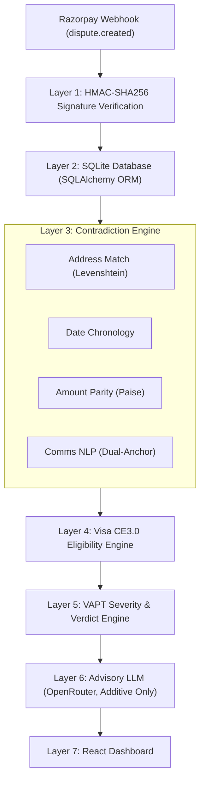

<p align="center">
  
</p>

# TRUSTMARK

<p align="center">
  <em>"certified before you submit."</em>
</p>

<p align="center">
  <a href="https://github.com/phoenix-2211/TRUSTMARK/blob/main/LICENSE"></a>
  
  
  
  <a href="[LIVE_DEMO_URL]"></a>
</p>

A pre-submission chargeback evidence verification gate for merchants and payment platforms.

**Most dispute tools help you submit evidence fast. TRUSTMARK checks whether that evidence should be trusted before it ever reaches the card network.**

---

## Table of Contents

- [The Problem](#the-problem)
- [What TRUSTMARK Does](#what-trustmark-does)
- [Architecture — 7-Layer Pipeline](#architecture--7-layer-pipeline)
- [Tech Stack](#tech-stack)
- [Key Results](#key-results)
- [Screenshots](#screenshots)
- [Getting Started](#getting-started)
- [Project Structure](#project-structure)
- [Documentation](#documentation)
- [Development Notes](#development-notes)
- [License](#license)
- [Author](#author)

---

## The Problem

Merchants lose chargeback disputes not because their underlying case is weak, but because their submitted evidence contradicts itself. Common failure modes include shipping proof delivered to a different city than the order address, fulfillment dates listed prior to order placement, currency subunit discrepancies, or support chat logs contradicting carrier tracking. 

When card networks (Visa, Mastercard) detect contradictory evidence, the submission is automatically rejected or heavily penalized. TRUSTMARK catches these flaws before submission.

---

## What TRUSTMARK Does

Existing chargeback platforms (such as Stripe Smart Disputes or Chargeflow) focus on assembling and auto-submitting evidence quickly. TRUSTMARK operates differently: it is an independent, defense-only verification gate that deliberately attempts to falsify the merchant's own evidence prior to submission. 

TRUSTMARK contains **zero dispute-mutation endpoints** (no Accept, Submit, or Challenge buttons exist). It acts purely as a pre-submission security auditor to prevent premature or flawed network submissions.

---

## Architecture — 7-Layer Pipeline



---

## Tech Stack

### Backend
| Technology | Version / Scope | Description |
|:---|:---|:---|
| **FastAPI** | `>= 0.100.0` | High-performance REST web framework |
| **Uvicorn** | `>= 0.22.0` | ASGI web server |
| **SQLAlchemy + SQLite** | `>= 2.0.0` | ORM & local storage |
| **Pydantic** | `>= 2.0.0` | Data validation and schema enforcement |
| **python-Levenshtein + difflib** | `>= 0.21.0` | Address normalization and string distance ratio |
| **sentence-transformers** | `all-MiniLM-L6-v2` | Dual-anchor semantic NLP embeddings (optional) |
| **OpenRouter API** | `gpt-4o-mini` | Advisory merchant explanation layer |
| **Requests** | `>= 2.28.0` | HTTP client for external integrations |
| **python-dotenv** | `>= 1.0.0` | Environment variable parsing |

### Frontend
| Technology | Version / Scope | Description |
|:---|:---|:---|
| **React** | `^18.2.0` | UI component library |
| **Vite** | `^4.4.5` | Next-generation frontend tooling |
| **Tailwind CSS** | `^3.3.3` | Utility-first styling framework |
| **Lucide React** | `^0.263.1` | UI icon set |
| **Recharts** | `^2.7.2` | Data visualization charts |
| **Google Fonts** | `Cinzel + Inter` | Brand and body typography |

---

## Key Results

| Metric | Value |
|:---|:---|
| **Precision** | **100.0%** (0 false positives) |
| **Recall** | **91.71%** |
| **F1 Score** | **95.68%** |
| **False Positive Rate** | **0.00%** (0/782 clean cases) |
| **Test Dataset** | 1,868 held-out cases from 6,000 synthetic disputes |
| **Supported Reason Codes** | `10.4` (Visa Fraud), `13.1` (Not Received), `13.3` (Not as Described) |

Zero legitimate disputes were ever wrongly flagged, meaning no merchant loses a winnable case to a false alarm.

---

## Screenshots

| View | Screenshot |
|:---|:---|
| **Verification Queue** |  |
| **Dispute Detail (READY)** |  |
| **Dispute Detail (NEEDS REVIEW)** |  |
| **Evidence Library** |  |
| **Benchmark Report** |  |

---

## Getting Started

### Try it live
Experience the full interactive dashboard without setup: **[[LIVE_DEMO_URL]]([LIVE_DEMO_URL])**

### Run locally

```bash
# Backend
pip install -r requirements.txt
uvicorn app.main:app --reload --host 127.0.0.1 --port 8000

# Frontend
cd frontend && npm install && npm run dev

# Run Benchmark
python scripts/fast_eval.py

# Run Tests
pytest tests/ -v
```

---

## Project Structure

```
.
├── Logo.png                        # Brand logo asset
├── README.md                       # Repository documentation
├── vercel.json                     # Vercel deployment configuration
├── render.yaml                     # Render web service blueprint
├── requirements.txt                # Python backend dependencies
├── package.json                    # Root build scripts
│
├── api/
│   └── index.py                    # Vercel serverless entrypoint
│
├── app/
│   ├── main.py                     # FastAPI app entrypoint & static mount
│   ├── api/
│   │   └── router.py               # REST API endpoints
│   ├── db/
│   │   ├── database.py             # SQLAlchemy session & engine
│   │   ├── models.py               # 7 database ORM models
│   │   └── seed.py                 # Cold-start auto-seeding helper
│   ├── eval/
│   │   └── evaluator.py            # Held-out benchmark harness
│   └── rules/
│       ├── ce3.py                  # Visa CE3.0 eligibility engine
│       ├── completeness.py         # Required evidence completeness scorer
│       ├── contradiction.py        # Address, date, amount, NLP contradiction checks
│       ├── explanation_llm.py      # Advisory OpenRouter LLM module
│       ├── pipeline.py             # Verification pipeline orchestrator
│       └── verdict.py              # 3-tier verdict decision engine
│
├── docs/
│   ├── BUILD_SPECIFICATION.md      # Architecture & VAPT specification
│   ├── EVALUATION_REPORT.md        # Benchmark metrics report
│   ├── METHODOLOGY.md              # Methodological design & post-mortem
│   ├── PROMPT_SPECIFICATION.md     # Engineering prompt lineage
│   └── pitch_script.md            # 5-minute hackathon presentation script
│
├── frontend/
│   ├── package.json                # React 18 & Vite configuration
│   ├── vite.config.js              # Vite build setup & proxy
│   ├── tailwind.config.js          # Tailwind theme configuration
│   ├── public/                     # Static assets & synthetic evidence documents
│   └── src/
│       ├── App.jsx                 # Application shell & tab router
│       ├── api/client.js           # Resilient API client
│       └── components/            # React UI components
│
├── scripts/
│   ├── fast_eval.py                # Held-out evaluation CLI runner
│   ├── seed_demo.py                # Standalone demo seeder
│   └── generate_synthetic_evidence_docs.py  # Evidence document generator
│
└── tests/
    ├── test_ce3.py                 # Visa CE3.0 test suite
    ├── test_contradictions.py      # Contradiction engine test suite
    ├── test_nlp_comms.py           # NLP semantic test suite
    └── test_webhook_and_api.py     # API and webhook test suite
```

---

## Documentation

| Document | Description |
|:---|:---|
| **[BUILD_SPECIFICATION.md](./docs/BUILD_SPECIFICATION.md)** | Technical specification, schema definitions, and VAPT framing |
| **[EVALUATION_REPORT.md](./docs/EVALUATION_REPORT.md)** | held-out evaluation performance report |
| **[METHODOLOGY.md](./docs/METHODOLOGY.md)** | Methodological decisions, CE3.0 rules, and engineering post-mortem |
| **[PROMPT_SPECIFICATION.md](./docs/PROMPT_SPECIFICATION.md)** | Full prompt sequence used during system construction |
| **[pitch_script.md](./docs/pitch_script.md)** | 5-minute hackathon presentation script |

---

## Development Notes

### Challenges & Fixes

- **NLP False Positives on Receipt Confirmations**: Solved via a dual-anchor approach comparing non-receipt anchors against receipt-confirming anchors with a required margin of `+0.08`. This yielded **100% precision** on held-out test data.
- **NLP False Negatives on Indirect Phrasing**: Addressed by expanding the non-receipt embedding bank to cover indirect customer support statements.
- **Precision-Over-Recall Tuning**: Deliberately configured thresholds to ensure zero false positives (0.00% FPR), prioritizing merchant safety over aggressive flagging.
- **Webhook Idempotency**: Implemented UUID-based deduplication to gracefully process repeated Razorpay webhook payloads.
- **Vite Build Pathing for Vercel**: Resolved monorepo root delegation to ensure static Vite assets build cleanly into `frontend/dist`.

---

## License

Distributed under the MIT License (2026). See [LICENSE](./LICENSE) for details.

---

## Author

**Sarvesh Santhosh** — [github.com/phoenix-2211](https://github.com/phoenix-2211)
