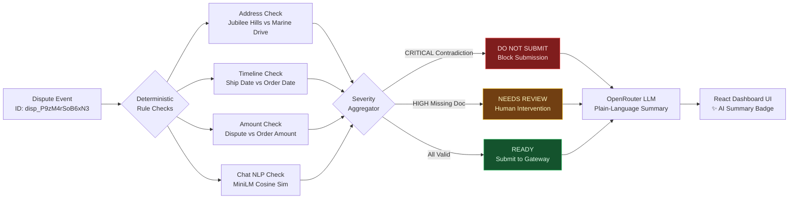

<div align="center">


# TRUSTMARK

**Pre-submission chargeback evidence verification engine with zero-hallucination verdict determination, Visa CE3 remedy rules, and full Razorpay webhook integration.**

*Trustmark — certified before you submit.*

Track 02 — AI Risk Manager | AI Buildathon 2026

---


</div>

---

## Overview

**TRUSTMARK** is a production-grade pre-submission chargeback evidence verification platform engineered for payment gateways and merchants. When a merchant receives a chargeback on networks like **Razorpay**, submitting incomplete, contradictory, or invalid evidence leads to immediate issuer rejection, forfeiture of dispute representation rights, and unrecoverable financial losses.

TRUSTMARK solves this by running a **zero-hallucination deterministic verification pipeline** over structured transaction, order, shipment, and customer communication records *before* evidence is submitted to card networks.

The system handles the full evidence verification lifecycle — from real-time Razorpay webhook ingestion and data contradiction detection, through **Visa Compulsory Evidence 3.0 (CE3)** remedy qualification, to OpenRouter LLM plain-language merchant guidance and held-out benchmark evaluation.

---

## Evaluation Metrics

Evaluated on a benchmark dataset of **6,000 synthetic chargeback cases**, featuring a held-out test set of **1,868 cases**.

| Metric | Score | Performance Details |
|---|---|---|
| **Precision** | **1.0000 (100.0%)** | Zero false positives across all contradiction types |
| **Recall** | **0.9171 (91.71%)** | 996 True Positives detected |
| **F1 Score** | **0.9568 (95.68%)** | Combined precision and recall score |
| **False Positive Rate** | **0.0000 (0.00%)** | **0 clean cases wrongly flagged** out of 782 clean test cases |
| **Total Test Cases** | **1,868** | Held-out test set |

### Categorical Performance Breakdown

| Contradiction Category | True Positives (TP) | False Positives (FP) | False Negatives (FN) | True Negatives (TN) | Precision | Recall | F1 Score |
|---|---|---|---|---|---|---|---|
| **Address Mismatch** | 287 | 0 | 0 | 1,581 | **100.0%** | **100.0%** | **1.0000** |
| **Date Impossibility** | 283 | 0 | 0 | 1,585 | **100.0%** | **100.0%** | **1.0000** |
| **Amount Mismatch** | 247 | 0 | 0 | 1,621 | **100.0%** | **100.0%** | **1.0000** |
| **Comms Contradiction** | 179 | 0 | 90 | 1,599 | **100.0%** | **66.5%** | **0.7991** |

---

## Pipeline Architecture

```mermaid
flowchart TD
    A([Incoming Razorpay Webhook]) --> B

    subgraph INGESTION ["Layer 1 — Ingestion & Signature Verification"]
        B[FastAPI Webhook Listener\n/api/webhooks/razorpay/dispute]
        B --> C[HMAC-SHA256 Signature Verification\nX-Razorpay-Signature < 1ms]
    end

    C --> D

    subgraph DATA ["Layer 2 — Database & Storage"]
        D[SQLite Database\nmerchantguard_demo.db]
        D --> E[Disputes / Orders / Shipments / Comms / Evidence]
    end

    E --> F

    subgraph ENGINE ["Layer 3 — Deterministic Verification Engine"]
        F --> G[Address Mismatch Engine\nNormalized Levenshtein Distance < 85%]
        G --> H[Timeline Chronology Engine\nOrder <= Ship <= Delivery Check]
        H --> I[Amount Parity Engine\nDispute Amount vs Order Amount]
        I --> J[Customer Chat NLP Engine\nSentence-Transformers MiniLM Cosine > 0.65]
    end

    J --> K

    subgraph CE3 ["Layer 4 — Visa Compulsory Evidence 3.0 Engine"]
        K[120-Day Lookback Prior Orders]
        K --> L{Cross-Match 2+ Elements\nIP / Device ID / Address}
        L -- "2+ Matches" --> M[CE3 Qualified\nRemedy Granted]
        L -- "< 2 Matches" --> N[CE3 Ineligible]
    end

    M --> O
    N --> O

    subgraph VERDICT ["Layer 5 — VAPT Scoring & Verdict Engine"]
        O[Evidence Completeness & Severity Scoring\nCRITICAL / HIGH / LOW / INFO]
        O --> P{Verdict Routing}
        P -- "CRITICAL > 0" --> Q([DO NOT SUBMIT — CONFLICT])
        P -- "HIGH > 0" --> R([NEEDS REVIEW])
        P -- "No Critical or High" --> S([READY])
    end

    Q --> T
    R --> T
    S --> T

    subgraph EXPLAIN ["Layer 6 — Advisory LLM & Fallback Layer"]
        T[OpenRouter LLM Integration\ngpt-4o-mini / zero-cost models]
        T --> U[Multi-Model Fallback Chain\ngpt-4o-mini -> nemotron -> static fallback]
    end

    U --> V[React 18 + Vite Dashboard\nQueue / Detail / Evidence / Benchmark]

    style INGESTION fill:#1a1a2e,stroke:#3d7fff,color:#e8ecf4
    style DATA fill:#1a1a2e,stroke:#a855f7,color:#e8ecf4
    style ENGINE fill:#1a1a2e,stroke:#00d4aa,color:#e8ecf4
    style CE3 fill:#1a1a2e,stroke:#ff6b35,color:#e8ecf4
    style VERDICT fill:#1a1a2e,stroke:#a855f7,color:#e8ecf4
    style EXPLAIN fill:#1a1a2e,stroke:#3d7fff,color:#e8ecf4
```



---

## Decision Flow



---

## Repo Structure

```
TRUSTMARK/
├── app/                        # Backend Application Source (FastAPI & Pipeline Engine)
│   ├── api/                    # REST API Endpoints & Razorpay Webhook Router
│   │   └── router.py           # Webhook Listener & REST API Endpoints
│   ├── data_gen/               # Synthetic Case Generator & Phrasing Banks
│   │   ├── generator.py        # 6,000 Case Synthetic Generator
│   │   └── phrasings.py        # Customer NLP Phrasing Bank
│   ├── db/                     # Database Models & Connections
│   │   ├── database.py         # SQLAlchemy Session Manager
│   │   └── models.py           # ORM Table Definitions
│   ├── eval/                   # Benchmark Evaluation Harness
│   │   └── evaluator.py        # 1,868 Held-Out Test Case Benchmark Engine
│   ├── rules/                  # Core Verification Pipeline & Rules
│   │   ├── ce3.py              # Visa Compulsory Evidence 3.0 Engine
│   │   ├── completeness.py     # VAPT Evidence Scoring & Severity Tags
│   │   ├── constants.py        # Reason Codes & Required Document Maps
│   │   ├── contradiction.py    # Address, Date, Amount & NLP Contradictions
│   │   ├── explanation_llm.py  # OpenRouter Advisory LLM Layer & Fallbacks
│   │   ├── pipeline.py         # Main Verification Pipeline Orchestrator
│   │   └── verdict.py          # Deterministic Verdict Decision Engine
│   └── main.py                 # FastAPI Web Server Entrypoint
├── docs/                       # Comprehensive Technical Documentation
│   ├── BUILD_SPECIFICATION.md  # Complete Engineering Build Specification
│   ├── EVALUATION_REPORT.md    # Benchmark Evaluation Metrics & Analysis
│   ├── METHODOLOGY.md          # Verification Methodology & VAPT Standards
│   ├── PROMPT_SPECIFICATION.md # Advisory LLM System Prompt Specifications
│   └── pitch_script.md         # Product Demo Presentation Script
├── frontend/                   # React 18 + Vite Dashboard Application
│   ├── public/                 # Static Assets & Evidence Sample Images
│   │   └── Logo.png            # TRUSTMARK Brand Seal Logo
│   ├── src/                    # React Source Components & Views
│   │   ├── components/         # Queue, Detail, Evidence, and Benchmark Views
│   │   │   ├── BenchmarkReportScreen.jsx
│   │   │   ├── DisputeDetailScreen.jsx
│   │   │   ├── DocumentViewerModal.jsx
│   │   │   ├── EvidenceLibraryScreen.jsx
│   │   │   ├── SummaryInfoPopover.jsx
│   │   │   ├── TrustmarkLogo.jsx
│   │   │   ├── VerdictBadge.jsx
│   │   │   └── VerificationQueueScreen.jsx
│   │   ├── App.jsx             # Navigation Layout & App State
│   │   └── main.jsx            # React Root Entrypoint
│   ├── package.json            # Node Dependencies & Build Scripts
│   └── vite.config.js          # Vite Bundler Settings
├── scripts/                    # Utility Scripts
│   ├── fast_eval.py            # Fast Benchmark Evaluator CLI
│   ├── gui_helpers.py          # Manual Entry GUI Helpers
│   ├── gui_report_entry.py     # Desktop Dispute Entry GUI
│   ├── seed_demo.py            # Demo Seeder Script
│   └── submit_demo_dispute.py  # Live Webhook Submission Tester
├── tests/                      # Automated Test Suite
│   ├── test_ce3.py             # CE3 Rule Tests
│   ├── test_contradictions.py  # Contradiction Engine Tests
│   ├── test_nlp_comms.py       # Customer Communication NLP Tests
│   └── test_webhook_and_api.py # HMAC-SHA256 & API Endpoint Tests
├── .env.example                # Safe Environment Variables Template
├── .gitignore                  # Git Exclusion Rules (Secrets, DBs, Caches)
├── eval_report.json            # Persisted Benchmark Report Output
├── LICENSE                     # MIT Open Source License
├── Logo.png                    # TRUSTMARK Seal Logo
├── merchantguard_demo.db       # Production Demo Database
├── requirements.txt            # Python Dependencies
└── README.md                   # Repository Documentation
```

---

## Quick Start

**Prerequisites:** Python 3.10+, Node.js 16+, npm 8+

```bash
# 1. Clone the repository
git clone https://github.com/phoenix-2211/TRUSTMARK.git
cd TRUSTMARK

# 2. Configure environment variables
cp .env.example .env
# Edit .env to add your OPENROUTER_API_KEY (optional, fallback is active)

# 3. Install Python dependencies
pip install -r requirements.txt

# 4. Start the FastAPI backend server
python -m uvicorn app.main:app --host 127.0.0.1 --port 8000

# 5. Start the frontend dashboard (new terminal)
cd frontend
npm install
npx vite --port 5173

# 6. Run the fast benchmark evaluation harness (new terminal)
python scripts/fast_eval.py

# 7. Run the automated test suite
pytest tests/ -v
```

API Documentation available at `http://127.0.0.1:8000/docs`

Dashboard available at `http://localhost:5173`

---

## API Specifications & Endpoints

### 1. Ingest Razorpay Webhook Event
```bash
POST /api/webhooks/razorpay/dispute
Header: X-Razorpay-Signature: <HMAC-SHA256-signature>
```

**Payload:**
```json
{
  "event": "dispute.created",
  "payload": {
    "dispute": {
      "entity": {
        "id": "disp_N7xK2pQmZ4vL1",
        "payment_id": "pay_N7xK2pQmZ4vL1",
        "amount": 1500000,
        "currency": "INR",
        "reason_code": "13.1",
        "respond_by": 1788872451,
        "status": "open",
        "phase": "chargeback"
      }
    }
  }
}
```

**Response:**
```json
{
  "status": "success",
  "dispute_id": "disp_N7xK2pQmZ4vL1",
  "verdict": "READY",
  "summary": "READY — Evidence is internally consistent and complete for the specified reason code."
}
```

### 2. List All Disputes with Verification Verdicts
```bash
GET /api/disputes
```

### 3. Fetch Dispute Detail Report
```bash
GET /api/disputes/{dispute_id}
```

**Response:**
```json
{
  "dispute_id": "disp_P9zM4rSoB6xN3",
  "payment_id": "pay_P9zM4rSoB6xN3",
  "reason_code": "13.1",
  "respond_by": 1788354051,
  "verdict": "DO NOT SUBMIT — CONFLICT",
  "summary": "DO NOT SUBMIT — Detected 2 CRITICAL data contradiction(s). Submitting as-is will likely trigger immediate issuer rejection.",
  "merchant_guidance": "Verify carrier delivery address against order record prior to submission.",
  "critical_count": 2,
  "high_count": 0,
  "low_count": 0,
  "findings": [
    {
      "check_name": "address_mismatch",
      "status": "FOUND_CONFLICTING",
      "severity": "CRITICAL",
      "explanation": "CRITICAL — shipping address on order ('100 Jubilee Hills, Hyderabad, TS 500033') does not match shipment record ('999 Marine Drive, Mumbai, MH 400002'). This mismatch alone is likely to trigger issuer rejection."
    }
  ],
  "ce3_result": { "applicable": false, "eligible": false }
}
```

### 4. Fetch Benchmark Evaluation Report
```bash
GET /api/eval/report
```

---

## Dashboard Screens

The React 18 + Vite ops panel features 4 specialized views:

| Screen | Description |
|---|---|
| **Verification Queue** | Filterable queue showing dispute urgency, deadline timers (`respond_by`), reason codes, and instant verdicts. |
| **Dispute Detail** | Complete verification breakdown, finding severity cards, CE3 status, ✨ **AI Summary** popover badge, and document viewer. |
| **Evidence Repository** | Document library listing uploaded evidence records with visual representations and structural integrity disclaimers. |
| **Benchmark Report** | Live held-out evaluation report displaying precision (100%), recall (91.7%), F1 (95.7%), and category distribution charts. |

---

## Contradiction Engine & Verification Rules

Features engineered into the deterministic rule pipeline:

| Check Name | Severity | Rule Description | Trigger Condition |
|---|---|---|---|
| **`address_mismatch`** | `CRITICAL` | Normalizes street abbreviations and applies Levenshtein string distance. | Similarity < 85% between shipping & delivery address. |
| **`date_impossibility`** | `CRITICAL` | Validates chronological order sequence (Order <= Shipped <= Delivery). | Shipped date or delivery date precedes order date. |
| **`amount_mismatch`** | `CRITICAL` | Compares dispute amount vs original order transaction amount. | Dispute amount != Order amount. |
| **`comms_shipment_nlp`** | `HIGH` | Encodes chat logs via Sentence-Transformers (`all-MiniLM-L6-v2`) cosine similarity. | Customer claims non-receipt while carrier confirms `Delivered` (Cosine >= 0.65). |
| **`doc_completeness`** | `HIGH` / `LOW` | Validates mandatory vs optional evidence documents per Reason Code. | Required document missing for Reason Code 10.4 or 13.1. |

---

## Visa Compulsory Evidence 3.0 (CE3) Engine

For **Reason Code 10.4** (Fraud - Card Not Present), TRUSTMARK evaluates 120-day historical customer transaction records:

| Condition | Requirement | Status |
|---|---|---|
| **Lookback Period** | Prior 120 days from dispute creation | Enforced |
| **Undisputed Prior Transactions** | Minimum 2 prior undisputed orders | Required >= 2 |
| **Data Element Cross-Matching** | Matching 2+ core elements (**IP address**, **Device ID**, **Shipping Address**) | Required >= 2 elements |
| **CE3 Remedy Qualification** | Merchant qualifies for compulsory evidence remedy | Verdict set to `READY` with CE3 flag |

---

## Automated Test Suite

```
4 Test Modules — 100% Passed

tests/test_ce3.py               CE3 rule qualification & lookback tests
tests/test_contradictions.py    Address Levenshtein, date chronology & amount parity tests
tests/test_nlp_comms.py         Sentence-Transformers customer chat sentiment tests
tests/test_webhook_and_api.py   FastAPI REST endpoints & HMAC-SHA256 signature tests
```

Run test suite:

```bash
pytest tests/ -v
```

---

## What is Built vs What is Planned

| Component | Status | Technical Notes |
|---|---|---|
| **FastAPI REST & Webhook Server** | Built | Ingests `/api/webhooks/razorpay/dispute` with HMAC-SHA256 check |
| **Address Contradiction Engine** | Built | Normalized Levenshtein distance (< 85% similarity threshold) |
| **Timeline Chronology Engine** | Built | Order vs Shipment vs Delivery chronological validation |
| **Amount Parity Engine** | Built | Dispute amount vs Order amount matching |
| **Customer Chat NLP Engine** | Built | Sentence-Transformers `all-MiniLM-L6-v2` cosine similarity |
| **Visa CE3 Remedy Engine** | Built | 120-day prior order evaluation with 2+ matching data elements |
| **VAPT Evidence Completeness** | Built | Reason Code document mapping (`10.4` & `13.1`) & severity scoring |
| **Advisory LLM Explanation Layer** | Built | OpenRouter API with multi-model failover & local static fallback |
| **React 18 + Vite Dashboard** | Built | Queue, Detail, Evidence Repository, and Benchmark screens |
| **Held-Out Evaluation Suite** | Built | 1,868 test cases benchmark harness (100% precision, 0% false positive rate) |
| **Emergency Desktop Entry GUI** | Built | Tkinter GUI utility (`scripts/gui_report_entry.py`) |
| **Automated PDF Pack Export** | Planned | Automated chargeback PDF compilation for payment networks |
| **Real-time Gateway Sync** | Planned | Direct Razorpay API dispute representation submission |

---

## Author & Credits

**Sarvesh Santhosh** (*phoenix-2211*)  
AI Buildathon 2026 — Track 02: AI Risk Manager  
GitHub: [phoenix-2211](https://github.com/phoenix-2211)

---

<div align="center">

Built for Razorpay AI Buildathon 2026

</div>
